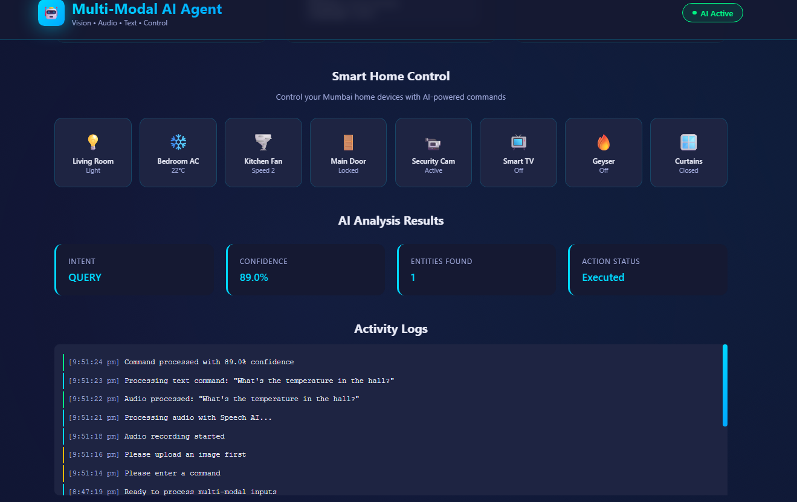

# Multi-Modal AI Agent for Smart Environments

A **multi-modal AI agent** capable of processing vision, audio, text, and control signals to manage a smart Indian home environment.

---

---

## ✨ Features

- **Multi-modal inputs**
  - Vision: upload an image (e.g., living room, appliances) and get detected objects.
  - Audio: simulated speech commands with intent and emotion detection.
  - Text: natural language commands to control devices and ask questions.
- **Smart Indian home control**
  - Control devices like:
    - Living Room Light (Mumbai)
    - Bedroom Fan (Ceiling)
    - Smart Geyser
    - Main Door Lock
    - Balcony Curtains
    - Smart TV (Tata Play / JioCinema)
    - Air Conditioner
    - Security Camera
  - Device state dashboard with real-time UI updates.
- **AI agent brain**
  - Modular architecture:
    - VisionModel (object detection)
    - AudioModel (speech / emotion intent)
    - TextModel (intent + entities)
    - FusionEngine (combines all modalities + context)
  - Simulated pickle model behaviour in JavaScript.
  - Confidence scores and reasoning text for each prediction.
- **Beautiful, modern UI**
  - Full-screen animated gradient background.
  - Glassmorphic cards with backdrop blur.
  - Smooth transitions, hover glows, and micro-interactions.
  - Responsive layout for desktop and mobile.

-
